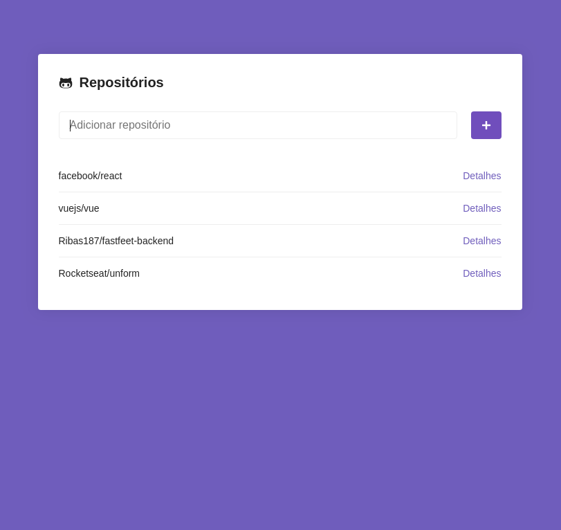
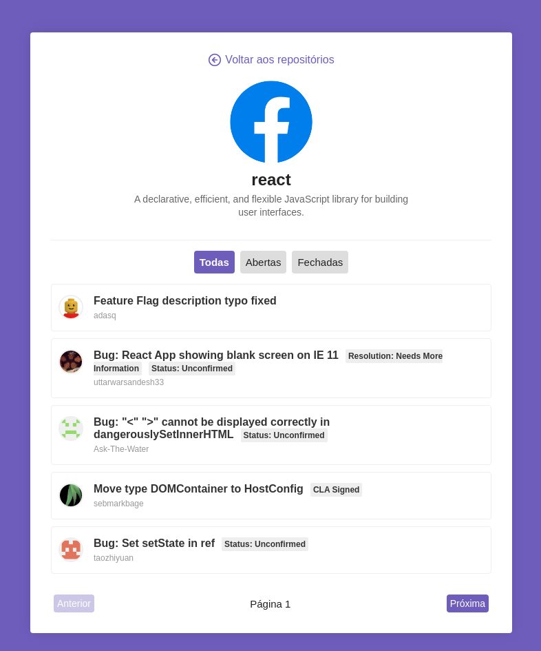

<h1 align="center">
    
</h1>

<h3 align="center">
  Desafio 5: Primeiro projeto com ReactJS
</h3>

<p align="center">“Para quem fica melhor a cada dia, ficar pronto é utopia”!</blockquote>

<p align="center">
  

  <a href="https://rocketseat.com.br">
    
  </a>

  

  <a href="https://github.com/Rocketseat/bootcamp-gostack-desafio-05/stargazers">
    
  </a>
</p>

<p align="center">
  <a href="#rocket-sobre-a-aplicação">Sobre a aplicação</a>&nbsp;&nbsp;&nbsp;|&nbsp;&nbsp;&nbsp;
  <a href="#-Instalação">Instalação</a>&nbsp;&nbsp;&nbsp;|&nbsp;&nbsp;&nbsp;
</p>

## :rocket: Sobre a aplicação

Esta aplicação consiste em buscar repositórios e listar suas issues. Feita com a integração com a api do gitHub.

### Funcionalidades

#### 1. Captando erros

`try/catch` por volta do código presente na função `handleSubmit` presente no componente `Main` e caso um repositório não seja encontrado na API do Github, uma borda vermelha é adicionada por volta do input em que o usuário digitou o nome do repositório.

#### 2. Repositório duplicado

Antes de fazer a chamada à API na função `handleSubmit` é feita uma verificação para ver se o repositório não está duplicado, ou seja, se ele ainda não existe no estado de `repositories`.

Caso exista, um erro é disparado, e com isso o código cairá no `catch` do `try/catch` criado na funcionalidade anterior.

#### 3. Filtro de estado

Filtro de estado na listagem de Issues no detalhe do repositório. Na qual o usuário pode visualizar as issues *abertas*, *fechadas* ou *todas*


#### 4. Paginação

Paginação nas issues listadas no detalhe do repositório. A API do Github lista no máximo 30 issues por página e você pode controlar o número da página atual.

Botão de próxima página e página anterior. O botão de página anterior fiva desativado na primeira página.

#### Instalação ####

```
yarn install && yarn start
```

Quando executar, abra o app em: http://localhost:3000/

#### Demo




## :memo: Guilherme Ribas
Desafio realizado por Guilherme Ribas.
